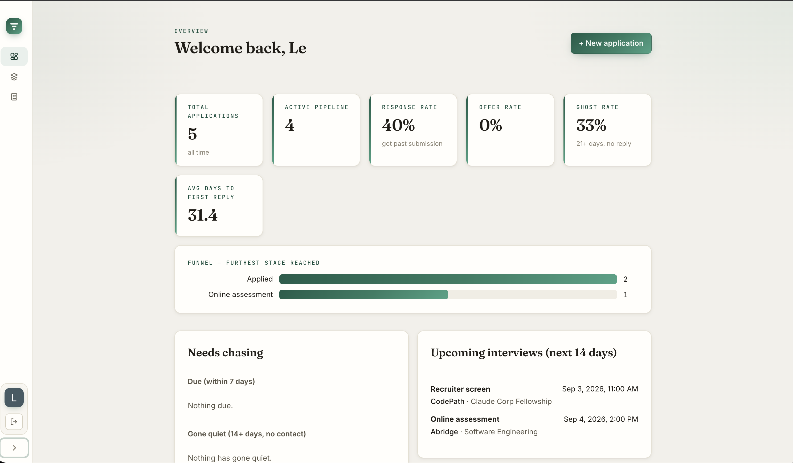
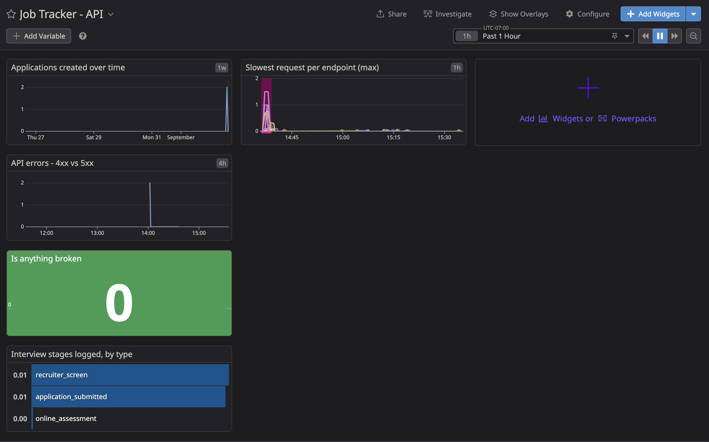

# Job Application Tracker

A full-stack web app for tracking a real job search — companies, roles, and the interview
rounds each application goes through — with Datadog observability and an MCP server that
lets Claude Desktop answer questions about it in natural language.

**Live:** [app4jobtrack.me](https://app4jobtrack.me) · deployed on an Oracle Cloud free-tier
VPS, auto-deploying from `main`.

[](https://github.com/LeDuyNg/Application-Tracker/actions/workflows/backend.yml)
[](https://github.com/LeDuyNg/Application-Tracker/actions/workflows/frontend.yml)

> **About the live link:** the app is deliberately single-user — sign-in is Google OAuth
> gated by an email allowlist, so the site will show you its landing page and not let you
> in. That is the intended behaviour, not a broken deployment. The screenshots below are
> what is behind the login.



---

## Why this exists

I was job hunting and wanted one place to answer questions a spreadsheet answers badly:
*how far do my applications actually get?*, *who has gone quiet?*, *what am I interviewing
for this week?* So the app is **used daily for its own purpose** — dogfooding is a project
goal, not a nice-to-have, and several bugs in here were found by using it rather than by
testing it.

It is also a deliberate exercise in three things that are usually demoed in isolation:
modelling data properly, running a service you can actually observe, and wiring an LLM into
a real system through a narrow, safe interface.

---

## What it does

| | |
|---|---|
| **Track** | Companies, applications, and an ordered list of interview **stages** per application (recruiter screen, OA, technical, superday, offer…) |
| **Derive** | Application status, current stage and last-contact date are computed from the stage history, not hand-maintained |
| **Answer** | A funnel and rates (response / ghost / offer), follow-ups due, pipelines gone quiet, upcoming interviews, free-text search |
| **Observe** | Custom Datadog metrics from the deployed instance, a dashboard, and an error-rate monitor |
| **Ask** | Four read-only MCP tools, so Claude Desktop can answer the same questions conversationally |

### The four read features

Each is one REST endpoint and one MCP tool — the same query serves the dashboard and Claude.

| Question | Endpoint | MCP tool |
|---|---|---|
| How is the search going? | `GET /api/stats` | `get_application_stats` |
| What should I chase? | `GET /api/applications/followups` | `list_pending_followups` |
| Anything about Stripe? | `GET /api/applications?q=` | `search_applications` |
| What's on my calendar? | `GET /api/applications/interviews?days=` | `get_upcoming_interviews` |

---

## Architecture

```
                         ┌──────────────────────────────────────────┐
                         │   Oracle E2.1.Micro VPS (Ubuntu, 1 GB)    │
                         │                                          │
  Browser ───HTTPS──────▶│  Nginx  ──/──────▶  React static build   │
                         │   :443   ──/api────▶ ┐                   │
                         │          ──/oauth2─▶ │  Spring Boot API   │
                         │          ──/login──▶ │  (systemd, :8080)  │
                         │                      └────────┬──────────┘
                         └───────────────────────────────┼───────────┘
                                                         │ mongodb+srv (TLS)
                                                         ▼
                                            ┌───────────────────────┐
                                            │  MongoDB Atlas M0     │
                                            │  companies ·          │
                                            │  applications         │
                                            └───────────▲───────────┘
                                                        │ Bearer token, HTTPS
  Claude Desktop ──stdio──▶  MCP server (local, TS)  ───┘  (read-only, GET only)

  Spring Boot API ──HTTPS──▶ Datadog API   (custom metrics via Micrometer, agentless)
```

The MCP server runs **on the laptop**, not the VPS, and calls the deployed API — so
validation and business rules live in exactly one place.

---

## Stack

| Layer | Choice | Notes |
|---|---|---|
| Language | **Java 25 (LTS)** | |
| Framework | **Spring Boot 4.1** | Spring Framework 7, **Jackson 3** (`tools.jackson.*`) |
| Data | **Spring Data MongoDB** + `MongoTemplate` | Aggregations for stats and the interview pipeline |
| Database | **MongoDB Atlas M0** | Free tier, 3-node replica set, TLS, IP allowlist |
| Auth | **Spring Security** — Google OAuth2 (OIDC) + static bearer token | Two filter chains; see below |
| Metrics | **Micrometer** → Datadog | Agentless, over HTTPS |
| API docs | springdoc-openapi 3.x | Swagger UI, disabled in prod |
| Tests | JUnit 5 + **Testcontainers** | Real MongoDB, not a mock |
| Frontend | **React 19**, **Vite 8**, **TypeScript 6** | TanStack Query, react-hook-form + zod, plain CSS |
| MCP | **TypeScript** on `@modelcontextprotocol/sdk` 1.30 | stdio transport |
| Infra | Oracle Cloud free tier, Nginx, certbot, systemd, GitHub Actions | Fat JAR, no Docker on the VPS |

**Scale:** ~3,850 lines of Java across 57 files, ~3,000 lines of TypeScript in the SPA,
~1,150 in the MCP server. 17 REST endpoints. **112 tests** — 25 unit, 87 integration.

---

## Data model

Two collections, using **both** MongoDB modelling techniques on purpose:

- `application → company` is a **reference** (`companyId` + a denormalized `companyName`).
  A company has independent identity and is shared across many applications; its data must
  not drift.
- `application → stages[]` is **embedded**. A stage is owned by the application, the list is
  small and bounded, and you never read a stage without its application — one round trip
  renders the whole pipeline.

Three fields are denormalized and maintained by the service layer: `status`,
`currentStageType` and `lastContactAt`. Each has a rule that is easy to get subtly wrong, so
each has its own test — for example, **terminal statuses are sticky**, because otherwise
marking an application `WITHDRAWN` and later fixing a typo in an old stage note would
silently flip it back to `ACTIVE`.

📄 **[SCHEMA.md](SCHEMA.md)** — full field list, indexes, enums, every query pattern.

---

## Observability

Custom metrics push straight from the deployed instance to the Datadog API via Micrometer.
Three domain counters (`jobtracker.applications.created`, `.stages.added` by stage type,
`.api.errors` by status) plus Actuator's request timer, a dashboard, and an error-rate
monitor.



**What is deliberately not here, and why** — the more interesting half:

- **No APM / distributed tracing.** Datadog APM is a separately-billed SKU and no trial is
  offerable on top of the student Pro plan. The alternatives — standing up a second Datadog
  org on a fresh evaluation trial, or running OpenTelemetry to a local Jaeger — were both
  considered and declined: the first means handling a second API key alongside production's
  for the sake of screenshots, the second adds a tool to a project that deliberately keeps
  its dependency count low.
- **No Datadog Agent, so no host infra metrics.** The Agent needs ~0.5 GB and the single
  1 GB host already runs a JVM at ~500 MB plus Nginx and the OS. Installing it would push the
  box into steady-state swapping on network-attached storage — breaking a working app to
  produce a screenshot.
- **A ~100 custom-timeseries budget**, which shaped the code. Boot's default Micrometer
  binders exceed it on a *completely idle* app, so the `MeterFilter` is an **allowlist**
  rather than a blocklist: a new dependency that ships a binder cannot quietly spend the
  budget, because a metric only ships when someone types its name into `MetricsConfig`.
  `outcome` and `exception` tags are stripped — an exception *class name* is a tag whose
  value set grows with the codebase.

---

## MCP server

Four narrow read-only tools rather than one "run any query" tool, so Claude picks correctly
from the descriptions and the data that can leave the API is fixed by the code rather than by
what someone asks for.

```json
{
  "mcpServers": {
    "job-tracker": {
      "command": "/absolute/path/to/node",
      "args": ["/absolute/path/to/mcp-server/dist/index.js"],
      "env": {
        "API_BASE_URL": "https://app4jobtrack.me",
        "API_TOKEN": "<the read-only bearer token>"
      }
    }
  }
}
```

### Sample Run
```text

How many applications have I sent this month?


Used 2 tools
Found tools
query: select:mcp__job-tracker__get_application_stats,mcp__job-tracker__search_applications
max_results: 5
Used job-tracker: Application statistics
from: 2026-09-01
to: 2026-09-02
Window: 2026-09-01 to 2026-09-02 (Sep 1, 2026 to Sep 2, 2026)
Total applications: 0

No applications fall in this window.
You've sent 0 applications this month (Sep 1–2, 2026). It's only the 2nd, so that window is basically just today and yesterday.

For reference, if you'd like a rolling look at the last 30 days instead, let me know and I'll pull that.

Which companies haven't I heard back from in 2+ weeks?


Used 2 tools
Found tools
query: select:mcp__job-tracker__list_pending_followups
max_results: 3
Used job-tracker: Pending follow-ups
Nothing needs chasing right now.
No follow-up reminders are due within 7 days, and no active application has been silent for 14 days or more.
None. No active application has been silent for 14+ days, and nothing has a follow-up reminder due within the next 7 days.

What interviews do I have this week?


Used 2 tools
Found tools
query: select:mcp__job-tracker__get_upcoming_interviews
max_results: 3
Used job-tracker: Upcoming interviews
days: 7
2 interviews scheduled in the next 7 days (times in America/Los_Angeles):
  - Thu, Sep 3, 2026, 11:00 PDT · CodePath — Claude Corp Fellowship · Recruiter screen
  - Fri, Sep 4, 2026, 14:00 PDT · Abridge — Software Engineering · Online assessment
You have 2 this week (times in America/Los_Angeles):

When	Company / Role	Round
Thu, Sep 3, 11:00 PDT	CodePath — Claude Corp Fellowship	Recruiter screen
Fri, Sep 4, 14:00 PDT	Abridge — Software Engineering	Online assessment
how many this month vs the last 30 days?


Used 2 tools
Applications sent:

This month (Sep 1–2, 2026): 0
Last 30 days (Aug 3 – Sep 2, 2026): 3 — all 3 still active
So all your recent activity was in August; nothing submitted yet in September.


```

**Read-only twice over.** The client exposes a single `get` method, so a write cannot be
*spelled* in the MCP codebase. Independently, the backend's bearer filter chain permits
`GET /api/**` and denies everything else — verified against the deployed instance:
`POST`, `PUT`, `PATCH` and `DELETE` with a valid MCP token all return 403.

Two details in the tool *descriptions* are load-bearing rather than decorative:

- **"This month" is a calendar range, not a rolling 30 days.** The API accepts either and
  echoes back which window it measured; the tool prints that window above the numbers, so a
  rolling count is never reported as a calendar month.
- **Partial words match.** Search uses an escaped case-insensitive regex rather than a
  `$text` index precisely so `strip` finds Stripe — the description says so, or the model
  "corrects" the user's term first.

📄 **[mcp-server/README.md](mcp-server/README.md)** — design notes and setup.

---

## Engineering decisions worth reading

The full reasoning — including reversals, with superseded entries left visible rather than
rewritten — is in **[CLAUDE.md §6](CLAUDE.md)**. A few highlights:

- **Two Spring Security filter chains, not one.** A `securityMatcher`-scoped stateless bearer
  chain plus a session/OAuth2 chain. This makes the MCP token's read-only rule a single
  request-matcher line instead of `@PreAuthorize` scattered over service methods, and removes
  the filter-ordering hazard entirely.
- **`lastContactAt` exists because `updatedAt` cannot serve.** `@LastModifiedDate` bumps on
  any write, so fixing a typo would reset it — which breaks "who has gone quiet?", one of the
  headline queries.
- **Search is a regex, not a `$text` index.** `$text` matches whole stemmed tokens, so
  typing `strip` would not find Stripe — unusable for a live filter bar.
- **Explicit `-Xmx256m`, not `MaxRAMPercentage`.** On a 1 GB box, 50% is a 512 MB heap with
  nothing left for metaspace, thread stacks, Nginx and the OS. `systemd` `MemoryMax` caps the
  service so a runaway kills the JVM rather than taking SSH down with it.

### Bugs found the interesting way

- **A test that only failed after 9pm.** A `daysOverdue` assertion used `LocalDate.now()` —
  the JVM's zone, not the app's configured `America/New_York`. It passed all day and failed
  at 21:00 Pacific, when it was already tomorrow in New York.
- **A test that passed locally and failed in CI with identical code.** MockMvc's `csrf()`
  post-processor swaps the `CsrfTokenRepository` on the *shared* Spring context and the swap
  outlives the test class. Maven's `runOrder` defaults to `filesystem`, which enumerates
  differently on macOS and Linux — so the two machines disagreed about class order, and with
  it the result.
- **A `@SpringBootTest` that was silently reading the dev database.** It had no Testcontainers
  and fell back to `mongodb://localhost:27017`, passing for three phases only because a dev
  container happened to be listening. The first CI run caught it instantly. `./mvnw verify`
  only reproduces CI if nothing is on 27017.

---

## Running it locally

```bash
# 1. MongoDB
docker run -d --name jt-mongo -p 27017:27017 mongo:8

# 2. API — http://localhost:8080, Swagger at /swagger-ui.html
cd backend
./mvnw spring-boot:run -Dspring-boot.run.profiles=local

# 3. SPA — http://localhost:5173, proxies /api /oauth2 /login to :8080
cd frontend && npm install && npm run dev

# 4. MCP server (optional)
cd mcp-server && npm install && cp .env.example .env   # then fill in API_TOKEN
npm run build && npm run inspect
```

```bash
cd backend
./mvnw test     # unit only, fast, no Docker
./mvnw verify   # + Testcontainers integration tests
```

Local secrets go in `backend/config/application-local.yml` (gitignored). Google OAuth
credentials are needed to sign in; see [CLAUDE.md §8](CLAUDE.md).

---

## Deployment

Fat JAR + `systemd` on an Oracle Cloud `VM.Standard.E2.1.Micro` (1/8 OCPU, 1 GB RAM), behind
Nginx with certbot TLS. No Docker on the VPS — the database is managed, so the box only runs
the API and Nginx, and containers would cost memory it does not have.

GitHub Actions deploys on push to `main`: `mvn verify` → `scp` a SHA-named JAR → repoint the
`app.jar` symlink (last three kept as the rollback) → `systemctl restart` → **poll
`/actuator/health` over SSH on the box** until `UP`. The health endpoint is loopback-only by
design, so a runner curling the public URL would 401 and fail every deploy.

📄 **[deploy/RUNBOOK.md](deploy/RUNBOOK.md)** — full server setup, deploy, rollback, and the
traps found while doing it.

---

## Non-goals

Named as decisions rather than omissions: multi-user or teams (single user, email allowlist —
a missed owner filter fails *silently*, which is worse for a portfolio than a clean
single-user app that documents the constraint), writes from the MCP layer, job-board
scraping, email/calendar notifications, a native mobile app, Kubernetes, and APM (above).
Frontend and end-to-end tests are also deliberate: the backend carries the test story and the
SPA is a single-user dashboard verified by using it daily.

---

## Repository

| Path | What |
|---|---|
| `backend/` | Spring Boot API, packaged by feature |
| `frontend/` | React SPA |
| `mcp-server/` | TypeScript MCP server |
| `deploy/` | systemd unit, Nginx vhost, runbook |
| [`CLAUDE.md`](CLAUDE.md) | Architecture, conventions, and the full decision log |
| [`SCHEMA.md`](SCHEMA.md) | Data model |
| [`PLAN.md`](PLAN.md) | Phased build plan |

## License

[MIT](LICENSE)
